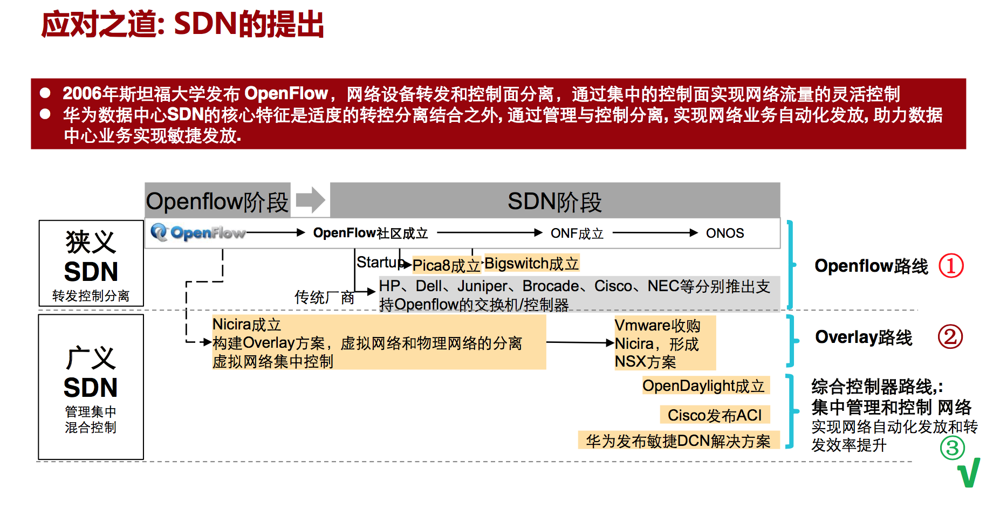
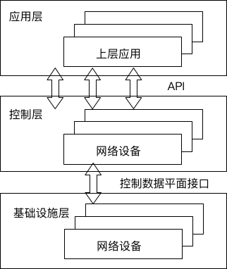
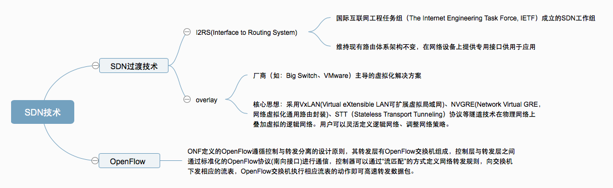

SDN & NFV
================
## 一、SDN
软件定义网络(Software Defined Networking, SDN)，诞生于美国GENI项目资助的斯坦福大学Clean Slate课题（2006年），是一种新型的网络架构和技术，核心思想在于将传统的IP网络的数据转发和路由控制进行分离，实现集中控制，分布转发，来简化网络优化网络，图1显示的是SDN的发展历程。
  
**图1 SDN的发展历程** 
图2是SDN的常见建构，主要有三部分组成：基础设施层、控制层和应用层，其中: 
  
**图2 SDN的逻辑架构**  
-  应用层：由业务和应用接口软件构成，可通过控制层抽象的**网络信息执行相应的控制算法**，形成网络策略，然后将**控制策略**通过控制层转换成流量控制命令下发给网元设备；
-  控制层：youSDN控制软件组成，通过标准化协议（如：OpenFlow、PCEP等），与下层进行通信，控制底层网络设备的转发行为，处理数据平面的**资源编排，维护网络拓扑，状态信息等**。控制层还将网络能力抽象进行抽象，向应用层提供开放的API（可以使用PostMan进行通信测试），也可以直接供应用层调用。
-  基础设施层，由转发设备组成，主要负责数据处理、转发和状态收集和处理。*（个人理解，既将收到的控制层下发数据通过对应的协议转发给各个化成各个网元设备对应的命令）*。 
常见的SDN技术主要分为两大类，SDN过渡技术（如：I2RS(Interface to Routing System)和overlay）和OpenFlow技术，图3显示的是SDN的技术分类。
  
**图3 SDN的技术分类** 
SDN技术特征：
-  控制器与转发器分离：将传统IP的控制面和转发面进行分离，转发设备抽象为一个通用的受控的网络设备，只关注转发和存储能力，与 **业务特性彻底解耦**。控制面则通过控制协议控制转发面的流量行为。
-  集中控制：将网络信息进行抽象处理构成统一的控制平台，实现逻辑上的集中式控制，从而获取网络资源的全局信息，并根据全局状态实现资源的全局调度和优化，提高网络控制的灵活性。
-  开发可编程：通过开放的API，应用层可以告知控制层如何进行网络资源操作才能更好地满足业务需求（如带宽、时延、计费等。另外，用户还可以根据），另外，用户还可以根据业务的需求定制网络功能，试试配置网络参数，加快业务响应速度等。
-  网络虚拟化：SDN通过软件控制简化的底层硬件，突破传统网络操作系统与专用硬件紧耦合的组织架构，将网络由静态的物理网络转变为面向用户、面向应用的动态逻辑网络。

## 二、NFV
网络功能虚拟化(Network Function Virtualization, NFV)，
## 三、SDN和NFV对比
### 3.1 关键点不同
  
| 序号     | SDN                                 | NFV                                       |
| :------: | :---------------------------------- | :---------------------------------------- |
| 1        | **将控制平面和数据平面分离**        | 将网络设备的功能从网络硬件中解耦出来      |
| 2        | 使用商用化、通用的路由器和交换机    | 将电信硬件设备从专用产品转为商业化产品    |
| 3        | 控制面可编程                        | 数据平面可编程                            |

### 3.2 起源
  
-  **SDN**起源于园区网，成熟于数据中心；
-  **NFV**始于运营商，最初主要是大型运营商在推广；

### 3.3 代表性人物
  
-  **SDN**，加州大学伯利克分校教授，Nicira创始人，美国工程院院士，SDN运动的主要开创者之一，计算机网络世界最著名的人物之一。
-  **NFV**，爱立信执行副总裁，现任沃达丰CTO。
### 3.4 适用范围
  
SDN跟NFV最明显的区别是，SDN处理的是OSI模型中的2-3层，NFV处理的是4-7。  
-  SDN主要是优化网络基础设施架构，比如以太网交换机，路由器和无线网络等。
-  NFV主要是优化网络的功能，比如负载均衡，防火墙，WAN网优化控制器等。

