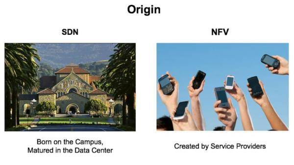
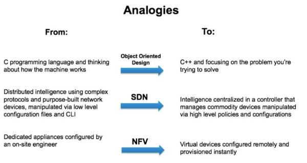

SDN & NFV
================
## 一、SDN
软件定义网络(Software Defined Networking, SDN)，诞生于美国GENI项目资助的斯坦福大学Clean Slate课题（2006年），是一种新型的网络架构和技术，核心思想在于将传统的IP网络的数据转发和路由控制进行分离，实现集中控制，分布转发，来简化网络优化网络，图1显示的是SDN的发展历程。
  
**图1 SDN的发展历程** 
图2是SDN的常见建构，主要有三部分组成：基础设施层、控制层和应用层，其中: 
  
**图2 SDN的逻辑架构**  
-  应用层：由业务和应用接口软件构成，可通过控制层抽象的**网络信息执行相应的控制算法**，形成网络策略，然后将**控制策略**通过控制层转换成流量控制命令下发给网元设备；
-  控制层：youSDN控制软件组成，通过标准化协议（如：OpenFlow、PCEP等），与下层进行通信，控制底层网络设备的转发行为，处理数据平面的**资源编排，维护网络拓扑，状态信息等**。控制层还将网络能力抽象进行抽象，向应用层提供开放的API（可以使用PostMan进行通信测试），也可以直接供应用层调用。
-  基础设施层，由转发设备组成，主要负责数据处理、转发和状态收集和处理。*（个人理解，既将收到的控制层下发数据通过对应的协议转发给各个化成各个网元设备对应的命令）*。 
常见的SDN技术主要分为两大类，SDN过渡技术（如：I2RS(Interface to Routing System)和overlay）和OpenFlow技术，图3显示的是SDN的技术分类。
  
**图3 SDN的技术分类** 
SDN技术特征：
-  控制器与转发器分离：将传统IP的控制面和转发面进行分离，转发设备抽象为一个通用的受控的网络设备，只关注转发和存储能力，与 **业务特性彻底解耦**。控制面则通过控制协议控制转发面的流量行为。
-  集中控制：将网络信息进行抽象处理构成统一的控制平台，实现逻辑上的集中式控制，从而获取网络资源的全局信息，并根据全局状态实现资源的全局调度和优化，提高网络控制的灵活性。
-  开发可编程：通过开放的API，应用层可以告知控制层如何进行网络资源操作才能更好地满足业务需求（如带宽、时延、计费等。另外，用户还可以根据），另外，用户还可以根据业务的需求定制网络功能，试试配置网络参数，加快业务响应速度等。
-  网络虚拟化：SDN通过软件控制简化的底层硬件，突破传统网络操作系统与专用硬件紧耦合的组织架构，将网络由静态的物理网络转变为面向用户、面向应用的动态逻辑网络。

## 二、NFV
网络功能虚拟化(Network Function Virtualization, NFV)，即用软件来安装、控制、操作那些运行在通用硬件上的网络功能，融合了云和虚拟化技术，使得新一代网络业务拥有更好的伸缩性和自动化能力。NFV则由运营商联盟提出，为了加速部署新的网络服务，运营商倾向于放弃笨重昂贵的专用网络设备，转而使用标准的IT虚拟化技术来拆分网络功能模块，如DNS、NAT、Firewall等。于是一些运营商联合成立了欧洲通信标准协会ETSI（European Telecommunications Standards Institute），他的一个工作组（ETSI ISG NFV）负责开发制定电信网络的虚拟化架构，如NFV MANO。 
下图是ETSI NFV标准架构：  
  
其中包括 **NFV infrastructure(NFVI)，MANO(Management and Orchestration)和VNFs**，三者是标准架构中顶级的概念实体。 
 **NFVI（NFV Infrastructure）** 包含了虚拟化层（hypervisor或者容器管理系统，如Docker，以及vSwitch）以及物理资源，如COTS服务器、交换机、存储设备等。NFVI可以跨越若干个物理位置进行部署，此时，为这些物理站点提供数据连接的网络也称为NFVI的一部分。为了兼容基于现有的网络架构，NFVI的网络接入点要能够跟其它物理网络互联互通。NFV支持多vendor，NFVI是一种通用的虚拟化层，所有虚拟资源应该是在一个统一共享的资源池中，不应该受制或者特殊对待某些运行其上的VNF。 
NFV、VNF三个同样的字母调换了顺序，含义截然不同。NFV是一种虚拟化技术或概念，解决了将网络功能部署在通用硬件上的问题；而VNF指的是具体的虚拟网络功能，提供某种网络服务，是软件，利用NFVI提供的基础设施部署在虚拟机、容器或者bare-metal物理机中。相对于VNF，传统的基于硬件的网元可以称为PNF。VNF和PNF能够单独或者混合组网，形成所谓的service chain，提供特定场景下所需的E2E网络服务。 
 **MANO（Management and Orchestration）** 提供了NFV的整体管理和编排，向上接入OSS/BSS，由NFVO（NFV Orchestrator）、VNFM（VNF Manager）以及VIM（Virtualised infrastructure manager）虚拟化基础设施管理器三者共同组成。Orchestration，本意是管弦乐团，在NFV架构中，凡是带’O’的组件都有一定的编排作用，各个VNF、PNF、及其它各类资源只有合理编排下，在正确的时间做正确的事情，整个系统才能发挥应有的作用。 
VIM：NFVI被VIM管理，VIM控制着VNF的虚拟资源分配，如虚拟计算，虚拟存储和虚拟网络。Openstack和VMWare都可以作为VIM，前者是开源的，后者是商业的。 
VNFM：管理VNF的生命周期，如上线、下线，进行状态监控、image onboard。VNFM基于VNFD（VNF描述）来管理VNF。 
NFVO：用以管理NS（Network Service，网络业务）生命周期，并协调NS生命周期的管理、协调VNF生命周期的管理（需要得到VNF管理器VNFM的支持）、协调NFVI各类资源的管理（需要得到虚拟化基础设施管理器VIM的支持），以此确保所需各类资源与连接的优化配置。onboard新的网络业务，VNF转发表，VNF package。 NFVO基于NSD（网络服务描述）运行，NSD中包含Service chain，NFV以及perfomance goal等。  
这样的设计实现了以下几个目的： 
1. NFV架构将物理网元的一些功能拆分开来，这样更便于运营商从多个vendor那里选择最适合自己的VNF。
2. VNF可以被用于不同的物理硬件和hypervisor。
3. 能够只通过软件进行快速发布。
4. 标准的开放接口便于multi-vendor间的VNF进行交互。
5. 使用低成本的通用硬件，不受制于特定供应商。

## 三、SDN和NFV对比
### 3.1 关键点不同
  

| 序号     | SDN                                 | NFV                                       |
| :------: | :---------------------------------- | :---------------------------------------- |
| 1        | **将控制平面和数据平面分离**        | 将网络设备的功能从网络硬件中解耦出来      |
| 2        | 使用商用化、通用的路由器和交换机    | 将电信硬件设备从专用产品转为商业化产品    |
| 3        | 控制面可编程                        | 数据平面可编程                            |

### 3.2 起源
  
-  **SDN**起源于园区网，成熟于数据中心；
-  **NFV**始于运营商，最初主要是大型运营商在推广；

### 3.3 代表性人物
  
-  **SDN**，加州大学伯利克分校教授，Nicira创始人，美国工程院院士，SDN运动的主要开创者之一，计算机网络世界最著名的人物之一。
-  **NFV**，爱立信执行副总裁，现任沃达丰CTO。
### 3.4 适用范围
  
SDN跟NFV最明显的区别是，SDN处理的是OSI模型中的2-3层，NFV处理的是4-7。  
-  SDN主要是优化网络基础设施架构，比如以太网交换机，路由器和无线网络等。
-  NFV主要是优化网络的功能，比如负载均衡，防火墙，WAN网优化控制器等。
### 3.5 转变
    

| Type     | From                                                          | To                                                  |
| :------: | :------------------------------------------------------       | :----------------------------------------           |
| SDN      | 用低级的管理工具管理分布式的， 采用复杂协议的专用网络设备 | 用高级管理工具管理商用设备组成 的集中式架构系统 |
| NFV      | 工程师现场配置专用设备                                        | 工程师远程配置虚拟化设备                            |

### 3.6 合作关系
虽然SDN与NFV的设计理念完全不同，但存在一定的合作关系。NFV白皮书对SDN和NFV地关系作出了相应的说明。总体来说，SDN和NFV是 **相互补充但又互不依赖的关系** ，如下图所示，
   
虽然SDN和NFV可以独立部署，但如果两者协同应用将是一个强大的结合： **结合SDN提出的控制平面和数据平面分离的方法，NFV可以提高性能、兼容现有部署、简化运维工作；反之，NFV可以通过提供SDN可运行的基础设施来支持SDN。**  

#### 参考资料
http://www.doit.com.cn/p/255330.html  
http://blog.csdn.net/napolunyishi/article/details/60876466  
